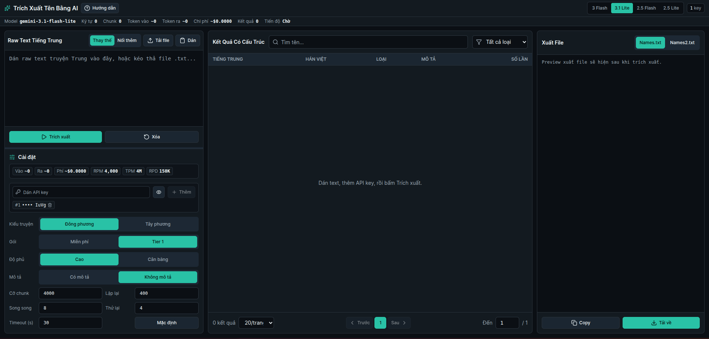
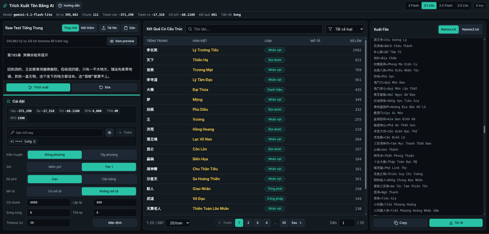

# AI Name Extractor

AI Name Extractor là công cụ chạy trên trình duyệt để trích xuất tên riêng từ raw text truyện tiếng Trung, sau đó xuất ra định dạng thân thiện với QuickTranslator như `Names.txt` hoặc `Names2.txt`.

Ứng dụng gọi trực tiếp Gemini, DeepSeek hoặc OpenAI từ browser, tự chia text dài thành chunk, xoay nhiều API key, retry lỗi tạm thời, và có thể chạy tiếp từ chunk lỗi nếu raw text/model/settings chưa đổi.



## Tính năng

- Trích xuất entity tiếng Trung thành dòng `Tên Trung=Tên hiển thị tiếng Việt`.
- Hỗ trợ truyện Đông phương/tiên hiệp với Hán Việt có dấu.
- Hỗ trợ truyện quốc tế hoặc lai nhiều bối cảnh: tên nước ngoài giữ phiên âm/spelling gốc khi rõ, ngữ cảnh Nhật ưu tiên romanization kiểu Hepburn, còn tên Hán/tu tiên vẫn giữ Hán Việt.
- Phân loại entity: `Person`, `Location`, `Faction`, `Artifact`, `Skill`, `Title`, `Creature`.
- Xuất nội dung cho `Names.txt` và `Names2.txt`.
- Tự format tên có dấu chấm giữa hoặc gạch ngang để QuickTranslator hiểu được. Ví dụ `洞冥·旋风杀` sẽ được xuất thành `洞冥 · 旋风杀`.
- Chia raw text dài thành chunk có overlap.
- Hỗ trợ nhiều API key theo provider và xoay key theo request.
- Có retry, backoff khi rate limit, timeout, và tự tách đôi chunk khi request timeout.
- Có thể retry tiếp từ chunk lỗi nếu source text và settings vẫn khớp.
- Lưu settings/API key trong local storage của browser.



## Dùng ngay

Bạn có thể dùng bản đã deploy tại:

https://name-extractor.pages.dev

Yêu cầu cho người dùng:

- Trình duyệt hiện đại.
- Một hoặc nhiều API key của provider bạn chọn.

## Chạy local cho developer

Nếu muốn sửa code hoặc tự build:

```bash
npm install
npm run dev
```

Build production:

```bash
npm run build
npm run preview
```

Kiểm tra TypeScript:

```bash
npm run typecheck
```

## Workflow cơ bản

1. Dán raw text truyện Trung hoặc tải file `.txt`.
2. Thêm ít nhất một API key đúng với provider của model đang chọn.
3. Chọn model, quota, kiểu truyện, độ phủ, cỡ chunk, số request song song, số lần retry và timeout.
4. Bấm `Trích xuất`.
5. Kiểm tra bảng kết quả, lọc/sort nếu cần.
6. Thêm rule `Han=Viet` trong `Sửa Hán Việt` nếu cần đổi cách hiển thị theo toàn cục hoặc theo loại.
7. Copy hoặc tải `Names.txt` / `Names2.txt`.

Với OpenAI proxy tương thích SDK OpenAI, chọn model OpenAI rồi cấu hình thêm `Base URL` dạng `https://.../v1` và `Model ID` proxy cấp.

Xem hướng dẫn đầy đủ tại [docs/USAGE.md](docs/USAGE.md).

## API key, quota và billing

App có hỗ trợ xoay nhiều free API key. Cách này dùng được để test, chạy đoạn ngắn, hoặc tránh một key bị quota tạm thời. Nhưng với truyện dài, free tier vẫn bị giới hạn RPM/TPM/RPD thấp hơn, dễ chậm và dễ vấp quota.

Setting `Quota` trong app dùng để điều tiết RPM/TPM/RPD theo quota thật của Gemini API key. Đây không phải gói trả phí của app:

- `Free API`: dùng rate limit free tier.
- `Paid Tier 1`: dùng rate limit Tier 1 sau khi project đã bật billing.

Khuyến nghị model:

- Dùng `Gemini 3.1 Flash` nếu bạn đang chạy bằng Free API key.
- Dùng `Gemini 3.1 Flash Lite` nếu bạn đã setup billing và chạy Paid Tier 1.

Nếu dùng nghiêm túc, nên setup billing và dùng key Paid Tier 1:

- Rate limit cao hơn.
- Chạy truyện dài ổn định hơn.
- Phù hợp với concurrency cao hơn.
- Ít phải canh lỗi quota/rate limit.

Nên đặt billing alert, quota limit và API key restriction trong Google Cloud. Không commit API key thật lên GitHub.

## Bảng giá mẫu

Repo này có bảng giá mẫu trong app để ước lượng chi phí. Đây là số mẫu dùng cho calculator của tool, không phải cam kết giá hiện tại của Google. Trước khi công bố số giá cho người dùng, hãy kiểm tra trang chính thức: https://ai.google.dev/gemini-api/docs/pricing

| Model | Giá input mẫu / 1M token | Giá output mẫu / 1M token |
| --- | ---: | ---: |
| Gemini 3 Flash | $0.50 | $3.00 |
| Gemini 3.1 Flash Lite | $0.25 | $1.50 |
| Gemini 2.5 Flash | $0.30 | $2.50 |
| Gemini 2.5 Flash Lite | $0.10 | $0.40 |
| DeepSeek V4 Flash | $0.14 | $0.28 |
| GPT-5.4 Nano | $0.05 | $0.40 |

Free API hiển thị phí `$0` trong app vì request free-tier không bị tính tiền, nhưng free tier có limit thấp hơn và phù hợp nhất cho test hoặc workload nhỏ. Token trong app là ước lượng theo provider: Gemini dùng khoảng 4 ký tự cho 1 token; OpenAI dùng heuristic conservative khoảng 1 token cho mỗi ký tự Hán và 0.25 token cho mỗi ký tự còn lại; DeepSeek dùng heuristic theo tài liệu DeepSeek, khoảng 0.6 token cho mỗi ký tự Hán và 0.3 token cho mỗi ký tự còn lại. Số thực tế có thể lệch theo tokenizer/model và cache hit của DeepSeek.

## Tài liệu

- [Hướng dẫn sử dụng](docs/USAGE.md)
- [Tài liệu kỹ thuật](docs/TECHNICAL.md)
- [Hướng dẫn đóng góp](CONTRIBUTING.md)
- [Folder ảnh tài liệu](docs/images/README.md)

## Lưu ý bảo mật

Đây là app client-side. API key được nhập trong browser và lưu ở local storage. Không deploy bản public có API key của bạn hard-code trong source. Người dùng nên tự nhập key của họ khi chạy local/private.

Nếu fork hoặc host app này:

- Không commit API key thật.
- Ưu tiên dùng local hoặc private deployment.
- Nói rõ với người dùng rằng browser sẽ gọi trực tiếp API của provider đang chọn.
- Dùng API key restriction và billing alert trong Google Cloud.

## License

Project dùng GNU General Public License v3.0 only. Xem [LICENSE](LICENSE).
